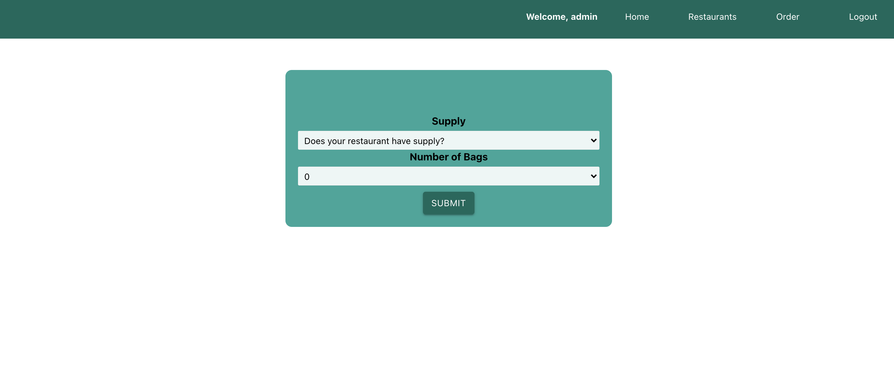
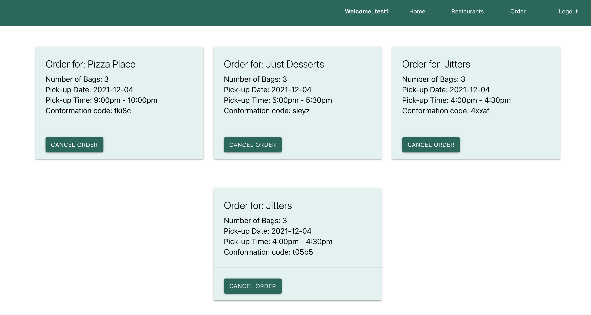

# Food Waste Fighters

Food waste Fighters is an anti food waste app. Inspired by the app Too Good to Go, Food waste Fighters allows a user to purchase mystery bags of surplus food from local shops. A user has the ability to select a shop they would like to rescue a a bag from. The users is then given the option to choose how many bags they would like to purchase. once the order is created the user is given a confirmation code and a pickup time for their order.
The admin functionality is allows business to let users know if they have surplus and how many.

## Screenshots

## Tech Stack

Node, Express, Mongoose, MongoDB, React

## Deployment

https://foodwastefighters.herokuapp.com/

## Next Steps

Have the number of bags change based on a users order.
Make the app responsive.
Render a map for each shop.
Send confirmation email to user.
